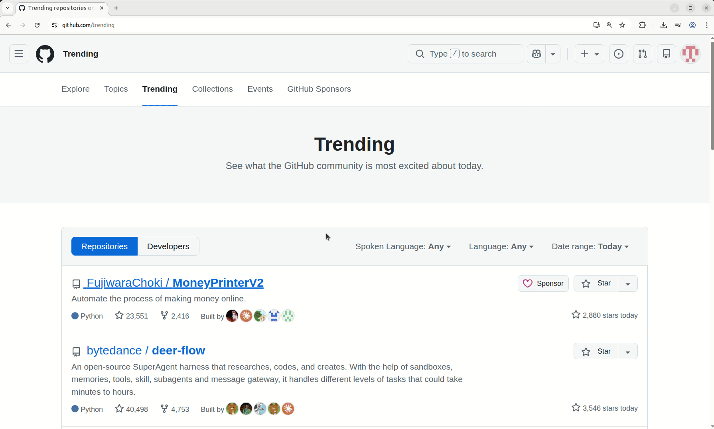

# AI Link Wrapper Chrome Extension

A Chrome extension that allows you to open links through configured proxy/wrapper URLs via context menu.

## Background

Modern AI search tools often provide special debugging URLs that allow you to inspect and analyze search results in detail. This extension was built to streamline the debugging workflow in your browser. Instead of manually copying and pasting URLs together, simply configure your debugging service URLs once, then right-click any link to instantly open it through your preferred debugging proxy—making the iteration process faster and more efficient.

## Demo

## Features

- Right-click on any link to see "Open Link Via" menu options
- Configure custom proxy URLs and labels
- Automatically concatenate proxy URLs with the clicked link
- Persistent configuration stored in Chrome sync storage

## Usage

1. **Add Proxy URLs**: Click the extension icon, enter a label and proxy URL, then click "Add Proxy"
2. **Open Links**: Right-click any link → "Open Link Via" → Select your configured proxy
3. **Delete Proxies**: Click the "Delete" button next to a proxy configuration

## Example

- Configured URL: `https://r.jina.ai/`
- Clicked link: `https://x.com/LumaLabsAI`
- Result: Opens `https://r.jina.ai/https://x.com/LumaLabsAI` in new tab

## Installation

1. Download or clone this repository
2. Open `chrome://extensions/`
3. Enable "Developer mode" (top right)
4. Click "Load unpacked" and select this folder

## Files

- `manifest.json` - Extension configuration
- `popup.html/js` - Settings UI
- `background.js` - Context menu and link handling
